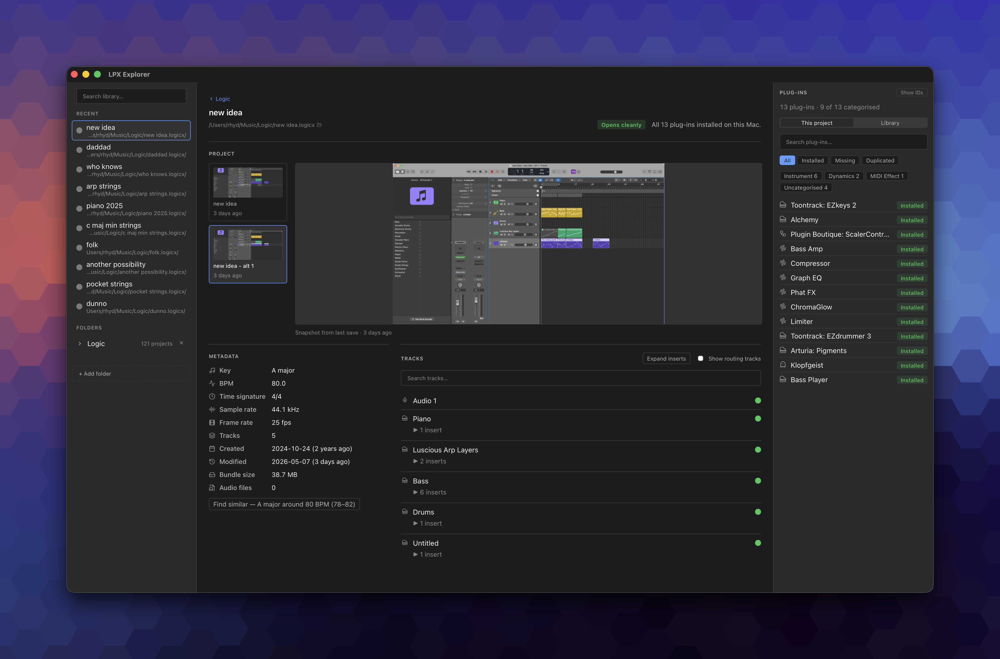

# lpx-explorer

Read-only macOS app for inspecting Logic Pro `.logicx` project bundles. See and search plug-ins, tracks, and project metadata without launching Logic. Built with Tauri 2 + React 19 + TypeScript + Rust.

## Why this exists

I have hundreds of Logic Pro projects on disk, many years old, with titles like "new idea", "new idea 2", and "3 tracks copy". Opening each one in Logic to remember what's inside takes an age — Logic is slow to launch, slower to load a project, and I can't easily browse across them. Another recurring problem: not every plug-in I've used is still installed, so some projects open with missing instruments and I don't find out until I'm already there.

LPX Explorer answers two questions: **what's in this project?** and **will it open cleanly on this Mac?** by parsing the undocumented files (e.g. `ProjectData`) inside a `.logicx` bundle and cross-referencing the Audio Unit plug-ins within against the AUs installed on your machine, without launching Logic and without touching a byte of the bundle.



## Read-only by construction

`.logicx` projects are irreplaceable user work. LPX Explorer is structurally incapable of writing to one:

- The Rust parser crate has a bytes-only API — `find_aus(&[u8])`, `find_tracks(&[u8])`, etc. It cannot open a file.
- The Tauri command layer reads bytes once and routes them through the parser.
- An integration test (`src-tauri/tests/readonly_invariant.rs`) snapshots SHA-256 + mtime around every parse path and asserts no byte changed.
- CI fails if the invariant fails. It is gated, not aspirational.

However...

> [!WARNING]
> ⚠️ **Use at your own risk.** LPX Explorer parses an undocumented binary format that Apple may change at any time. The read-only invariant covers the parser, but you are still pointing it at irreplaceable creative work. Always keep backups. The author accepts no liability for project corruption, data loss, or anything else that might go wrong.

## What it does

### Pick a project, see the details

- Compatibility verdict band — `clean` / `warnings` / `will-not-open`, with a CTA that jumps to the first missing plug-in.
- Screenshot of each alternative (if available)
- Project metadata — key, BPM, time signature, sample rate, dates, bundle size.
- Track list — kind (audio / instrument / folder / summing-stack), user-renamed names recovered from region records and the track registry, with expandable insert chains rendered as colour-coded pills (instrument / FX / MIDI).
- Plug-in rail — every AU referenced by the project, grouped by category, with install-status badges resolved against the local Audio Unit registry. Per-row actions for missing plug-ins (search, copy fingerprint) and an opt-in mono fingerprint sub-line for triage.

### Pick a folder, see the library

- Recursive scan of each `.logicx` bundle with idle-aware progress and per-project parse cache.
- Tile grid — name, musical line (key + BPM), counts, size; click to open.
- Folder rail with search; recent projects and recent folders surface in the native File menu.
- Plug-in rail flips to library scope — `47 plug-ins · 3 missing across 12 projects` — and each row expands to the contributing project paths.

Tested against roughly **[150 projects across ~20 GB]** without trouble.

### System integration

- Native macOS menu (File / Edit / View / Help) with `⌘O` open project, `⌘⇧O` open folder, theme switcher (System / Light / Dark), Open Recent submenus.
- Drag and drop a `.logicx` bundle or a folder onto the window.
- `⌘+` / `⌘-` / `⌘0` scales the UI.

## Relationship to `lpx-toolkit`

There are two projects in this family:

- **[`lpx-toolkit`](https://github.com/rhydlewis/lpx-toolkit)** — the original Python CLI. Built first as a proof-of-concept to understand the `.logicx` binary structure, a working command-line tool.
- **`lpx-explorer`** (this repo) — the macOS desktop app. Rust parser, native UI, idle-aware library scans.

The Rust parser crate (`lpx-parser`) is the long-term home for `.logicx` format knowledge. Future PyO3 bindings will let the Python CLI consume it directly so the format knowledge has one home.

## Plug-in support

LPX Explorer checks Audio Unit (AU) plug-ins only. The registry is populated by shelling out to `auval -l` once at startup and cached for the session. A manual rescan is available for when you've just installed new plug-ins without restarting the app.

## Install

<!-- TODO: update with download link / DMG instructions for the latest notarized release -->

## Build

```sh
git clone https://github.com/rhydlewis/lpx-explorer
cd lpx-explorer
npm install
npm run tauri:dev
```

Requirements: macOS, Node 20+, Rust ≥ 1.88 (pinned in `rust-toolchain.toml`), Xcode command-line tools.

## Develop

```sh
npm run tauri:dev          # full Tauri dev mode (Rust + Vite + window)
npm run dev                # Vite only (Tauri calls this automatically)
npm run quality            # typecheck + lint + frontend tests
cargo test --manifest-path src-tauri/Cargo.toml --workspace
                           # parser crate + Tauri command tests + read-only invariant
```

The pre-commit hook runs typecheck + lint-staged + Vitest. Bypass with `--no-verify`.

## Architecture

- `src-tauri/crates/lpx-parser/` — native Rust crate, single source of truth for `.logicx` format knowledge. Submodules: `metadata` (plist), `regions` (region records → user-renamed track names), `tracks` (track records + AU assignment), `tracks_registry` (registry record names), `auval` (AU registry parsing), `apple_stock` / `apple_drummer` (vendor allow-lists). Bytes-only API.
- `src-tauri/src/commands.rs` — Tauri command surface (`parse_project`, `project_data_stat`, `is_dir`, `home_dir`, `log_event`).
- `src-tauri/src/library.rs` — recursive folder scan (`scan_folder`).
- `src-tauri/src/auval.rs` — `auval -l` registry loader with on-demand rescan.
- `src-tauri/src/lib.rs` — native menu, recents, theme handoff.
- `src/components/` — React surfaces: `Inspector/` (project header, compatibility verdict, project info, track list, plug-in rail), `Library/` (home grid, tile, folder rail, search).
- `src/store/` — Zustand stores (project, library, library summaries, AU registry, UI / theme / zoom).
- `src/lib/` — IPC wrappers, AU categorisation, parse cache, persistence (via `tauri-plugin-store`), drop routing, idle detector, scan scheduler.
- `docs/decisions.md` — architecture decisions log (append-only).

The `&[u8]` parser API is the safety boundary.

## Known quirks (not bugs)

- **Duplicate fingerprints from undo history are real.** Logic keeps prior plug-in references in `ProjectData` even after you swap a plug-in. The Python CLI offers an opt-in dedupe filter; this app currently shows them as-is.
- **Phantom plug-ins from other Alternatives in the bundle are similarly real.** Open the project in Logic to see what the active alternative actually loads.

## Source-of-truth references

- [`lpx-toolkit/lpx_inspect.py`](https://github.com/rhydlewis/lpx-toolkit) — empirically-derived `.logicx` parser. Every offset and signature whitelist was reverse-engineered against real Logic projects.
- `src-tauri/crates/lpx-parser/` — Rust port + extension.
- [`BRIEF.md`](./BRIEF.md) — original walking-skeleton scope.
- [`docs/decisions.md`](./docs/decisions.md) — architecture choices and rationale.

## Support

If LPX Explorer has saved you from opening sketchy old projects in Logic, tips are very welcome:

[☕ Buy me a coffee](https://buymeacoffee.com/rhyd)

## License

GPL-3.0-or-later. See [`LICENSE`](LICENSE) for the full text.

In short: you're free to use, modify, and redistribute LPX Explorer, but any distributed derivative must also be GPL-licensed with source available. The reverse-engineering work that went into the `.logicx` parser stays open.