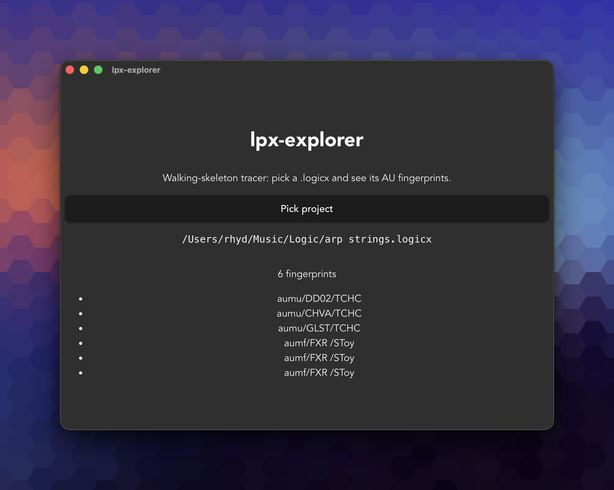

# lpx-explorer

Read-only inspector for Logic Pro `.logicx` project bundles. Tauri 2 + React 19 + TypeScript desktop app for macOS. A walking-skeleton port of the Python CLI [lpx-toolkit](https://github.com/rhydlewis/lpx-toolkit) — currently scoped to one tracer-bullet vertical: pick a project, see its Audio Unit fingerprints.



## What it does today

Pick a `.logicx` bundle. The Rust crate locates `<bundle>/Alternatives/*/ProjectData`, scans the binary for Audio Unit component descriptors (three contiguous little-endian 4CCs anchored on `umua` / `xfua` / `fmua`), and returns one fingerprint string per match in the form `type/subtype/manufacturer`. The frontend renders the count and the list.

That's it. No metadata, no track list, no plug-in name resolution, no caching, no `auval` lookup, no rollup, no library browser.

## How to dev

```sh
npm install                # one-time
npm run tauri:dev          # full Tauri dev mode (Rust + Vite + window)
```

Rust toolchain ≥ 1.88 (pinned in `rust-toolchain.toml`).

## How to test

```sh
npm test                   # frontend (Vitest, jsdom, IPC mocked)
npm run quality            # typecheck + lint + frontend tests
cargo test --manifest-path src-tauri/Cargo.toml --workspace
                           # parser crate + integration tests
```

The pre-commit hook runs typecheck + lint-staged + Vitest on every commit.

## Architecture

- `src-tauri/crates/lpx-parser/` — native Rust crate, single source of truth for `.logicx` format knowledge. Bytes-only API (`find_aus(&[u8]) -> Vec<AURef>`); cannot open files. Future PyO3 bindings will let the Python CLI consume this crate directly.
- `src-tauri/src/commands.rs` — Tauri command surface. Locates `ProjectData` inside the bundle and routes bytes through the parser.
- `src/lib/parse.ts` — typed wrapper around `invoke('parse_project', { path })`.
- `src/components/ProjectSummary.tsx` — renders fingerprint count + list.
- `docs/decisions.md` — architecture decisions log (append-only).

The `&[u8]` parser API is the read-only contract gate. `tests/readonly_invariant.rs` snapshots SHA-256 + mtime around `find_aus` to verify nothing in the call path mutates the source file.

## What's missing relative to the Python CLI

The Python tool at `/Users/rhyd/code/lpx-toolkit/` ships these surfaces (this skeleton ports none of them yet):

- **`parse_project` metadata** — key, BPM, time signature, sample rate, dates, bundle size.
- **Track list** — track-registry record parsing (`gRuA`, `OCuA`, `karT`), audio-strip mapping, summing-stack detection, focus-byte decoding. See `lpx-toolkit/CLAUDE.md` "Track-registry record format" for the format knowledge that needs porting.
- **`auval` lookup** — resolving fingerprints to human-readable plug-in names via `auval -l` (mocked, cached at `~/.cache/lpx-toolkit/auval.json`).
- **Phantom-plugin filtering** — duplicate fingerprints from undo history are *real* (the screenshot above shows three identical `aumf/FXR /SToy` entries — that's documented behaviour, not a parser bug). The Python CLI offers an opt-in filter; this skeleton does not.
- **HTML self-contained dashboard** (`--html`).
- **Library browser** (`--serve` HTTP server, recursive scan of `.logicx` folders).
- **Cross-project rollup** (`--rollup`).
- **Reveal-in-Finder, codesign integration, preset count, plug-in bundle scanning.**
- **Notarization, auto-updater (Sparkle), light/dark theme.**

## Scope guarantees (from the brief)

- Read-only contract — `find_aus` takes `&[u8]`, never opens a file. Integration test snapshots SHA-256 + mtime on every parse.
- macOS-only — Logic Pro is mac-only; no Windows/Linux conditionals.
- TDD discipline — RED → GREEN per vertical slice. See `docs/decisions.md` and per-slice commit messages for the trail.

## Issue tracking

Beads (`bd`). Walking-skeleton epic: `lpx-explorer-82n`. Run `bd ready` to see what's open.

## Source-of-truth references

- `/Users/rhyd/code/lpx-toolkit/lpx_inspect.py` — empirically-derived `.logicx` parser.
- `/Users/rhyd/code/lpx-toolkit/CLAUDE.md` — format knowledge, reverse-engineered offsets, "things that look like bugs but aren't."
- `BRIEF.md` (this repo) — walking-skeleton scope.
- `docs/decisions.md` — architecture choices and rationale.
